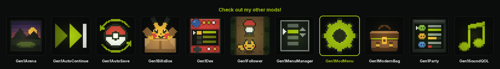

<p align="center">
  <a href="https://wild1walker.github.io/Gen1Wild/"></a>
</p>

<h1 align="center">Gen1ModMenu</h1>

<p align="center">
  <a href="https://wild1walker.github.io/Gen1Wild/"></a>
</p>

<p align="center">
  <b>The mod manager, made readable</b>
</p>

A UI mod for [Gen1Recomp](https://github.com/bryanthaboi/gen1recomp): it
redraws the in-game **MODS** screen. The mod list gets a status column,
sorting and filters; the per-mod **OPTIONS** page gets eleven rows on screen
instead of four, each with its value beside it and a line underneath saying
what it accepts.

Works on Red, Blue, Yellow and Gold/Silver (mod api 2). Nothing about how the
manager *behaves* changes — enabling, dependency closures, staged changes,
apply-and-restart, profiles and safe mode are all still the engine's. This
mod draws them.

## Install

1. Download `gen1_mod_menu-<version>.zip` from
   [Releases](https://github.com/wild1walker/Gen1ModMenu/releases).
2. In the game: **MODS → Import mod .zip**, pick the file, enable
   Gen1ModMenu.

The manifest already carries `"github": "wild1walker/Gen1ModMenu"`, so the
launcher offers updates and other versions on its own.

## The options page

This is the screen the mod exists for. Vanilla draws it through the engine's
shared option widget: four bordered 20×4 boxes, the label on one line and the
value on the next, four options visible at a time and nothing else on screen.
A mod with seven rows is two pages, and there is no room to say what any of
them do.

Here every option is one line — label on the left, value on the right — so
**eleven fit at once**, under the mod's name and version. Below them, a help
line for whichever row the cursor is on, read straight off the schema:

| Row type | Help line |
| --- | --- |
| toggle | `ON / OFF` |
| choice | every choice label, `ONCE / N BEEPS / VANILLA` |
| number | the range, `1-8`, and the step when it is not 1 |
| text | `UP TO 12 CHARS` |

A `.` beside a value means that row differs from the default its author
shipped, and **`RESET DEFAULTS`** at the bottom of the list puts every one of
them back.

There is no description field in the engine's option schema
(`docs/mod-option-schema.md` is `key`, `type`, `label`, `default`, `choices`,
`min`, `max`, `step`, `maxLen`, `visible_if`), so the help line says what the
row *accepts* rather than inventing prose the author never wrote.

## The mod list

A mod that is enabled and running carries **no mark at all** — a column
reading `ON` eleven times over is not information, and leaving it blank hands
three more glyphs to every name on the screen. The marks are the exceptions:

| Column | Reads |
| --- | --- |
| *(blank)* | enabled and running |
| `OFF` | disabled |
| `STGD` | changed, waiting on a restart |
| `ERR` | failed to load |
| `BLKD` | a dependency is not satisfied |
| `SKIP` | enabled and fine, but not for this game |

The same six appear as a legend on the `ERRORS` tab whenever there is nothing
wrong to show there. The full word is always one A-press away on the mod's
own detail screen.

## Options

All under **MODS → Gen1ModMenu → OPTIONS**.

- **STYLE** — `MODERN` or `VANILLA`. `VANILLA` hands every screen
  straight back to the engine's own renderer, and it is read on every frame,
  so the row takes effect without leaving the screen.
- **SORT BY** — `CATEGORY` (what the engine does, plus a stable order inside
  each group), `NAME`, `ENABLED`, or `PROBLEMS` — which floats errored and
  blocked mods to the top.
- **HIDE OFF** — drop disabled mods from the list.
- **WITH OPTIONS** — show only the mods that have something to configure.
- **HELP LINE** — the line under the options list. Off gives its row back to
  the list, making it twelve.
- **RESET ROW** — show `RESET DEFAULTS` on each mod's options page.
- **KEEP CURSOR** — reopen the manager on the row you left it on.

Neither filter can hide Gen1ModMenu itself. Both are set from its own options
page, and that page is reached through the list they filter.

## How it works, and how it gets out of the way

The engine's manager is `src/mods/ManagerState.lua`, and there is no hook on
it. What it does have is a screen id: `src/ui/Screens.lua` resolves
`"ManagerState"` out of the registry *before* falling back to its own
builtin, so registering that id replaces the screen on every route in — the
START menu, the OPTION screen, `F10`, and Gold's own push.

What this mod hands back is the engine's own instance with its draw methods
swapped. The thousand lines behind the screen — `resolveToggle`'s dependency
closure, staged changes, apply-and-restart, profiles, the Gen 2 override,
safe mode — are untouched, because a divergence there does not look like a
skin bug, it looks like a boot that no longer comes up. Reaching the builtin
means requiring it by name, which is the whole reason the manifest declares
`engine_internals`; nothing here patches engine code in place.

This is the one screen a player uses to switch off a mod that is
misbehaving, so there are three independent ways back to the vanilla one:

1. **`STYLE: VANILLA`**, read on every call.
2. **A renderer that throws** is logged once and demoted to the engine's own
   draw for the rest of the visit.
3. **`Screens.build` already pcalls a mod screen's `new`** and falls back to
   the builtin, so a mod that cannot construct its screen at all leaves the
   manager exactly as it was.

## What it does not touch

- **The launcher's mod-options screen** (`src/import/LauncherSettings.lua`)
  is a different screen, outside the game, where no mod is loaded. No mod can
  reskin it.
- **Link play** — `affects_link: false`. This only draws a menu.
- **Your saves** — the mod stores nothing in them. Its own settings are
  option rows, which is what lets them work on the title screen too, before a
  playthrough has been adopted.

## Layout

- `manifest.json` — identity, version, load order
- `main.lua` — the entry chunk; loads the modules below through `mod:read`
- `src/options.lua` — the option schema and the validating reader
- `src/rows.lua` — the list model: sorting, filtering, status words, help text
- `src/skin.lua` — the renderer
- `src/screen.lua` — registering the screen, and decorating the instance
- `tests/` — the headless suite (no ROM needed)

## Development

You need a [Gen1Recomp](https://github.com/bryanthaboi/gen1recomp) checkout.
Put this repo at `mods/gen1_mod_menu` inside it (a symlink is fine):

```sh
git clone https://github.com/wild1walker/Gen1ModMenu
ln -s "$PWD/Gen1ModMenu" path/to/gen1recomp/mods/gen1_mod_menu
```

Then, from the engine root:

```sh
python3 tools/modkit.py validate gen1_mod_menu      # manifest + real merge
python3 tools/modkit.py lint gen1_mod_menu          # no ROM-derived content
python3 tools/modkit.py gen2check mods/gen1_mod_menu
luajit mods/gen1_mod_menu/tests/gen1_mod_menu_test.lua
```

The suite is ROM-free: it merges into the engine's fixture dataset, so it
runs anywhere the engine checks out. `.github/workflows/ci.yml` runs exactly
those four commands on every push and pull request.

The last tier of the suite is worth knowing about. It runs the renderer for
real — every screen, against the engine's own `Font` and `Theme` over the
fixture data — with each draw recorded, and asserts two things about all of
them: that they land inside the box the screen is drawn in, and that they
spell only characters the Game Boy charmap carries. The charmap has no `+`,
`*`, `&`, `<`, `>` or `=`, and a character it does not carry is rendered as a
space, silently.

For the 10-minute loop, run the engine with `POKEPORT_DEV=1 love .` and press
`F5` to hot-reload after an edit.

## Releasing

Releases are cut by CI. To ship a version:

1. Bump `version` in `manifest.json`.
2. Add the matching `## <version>` section to `CHANGELOG.md` (CI fails if the
   two disagree).
3. Merge to `main`.

`.github/workflows/release.yml` then runs CI, resolves the version, packs
every mod file into `gen1_mod_menu-<version>.zip` with `manifest.json` at the
archive root, and publishes a GitHub Release with the zip and a
`sha256sums.txt`. Version resolution, first rule that applies:

1. the `version` input of a manual **Run workflow**,
2. `[release X.Y.Z]` anywhere in the commit message,
3. `manifest.json`'s own version, when it is ahead of every existing tag.

If none of the three apply, the run stops after CI and publishes nothing.
**A release is always a deliberate version bump.**

## Licence

MIT. See [LICENSE](LICENSE).
